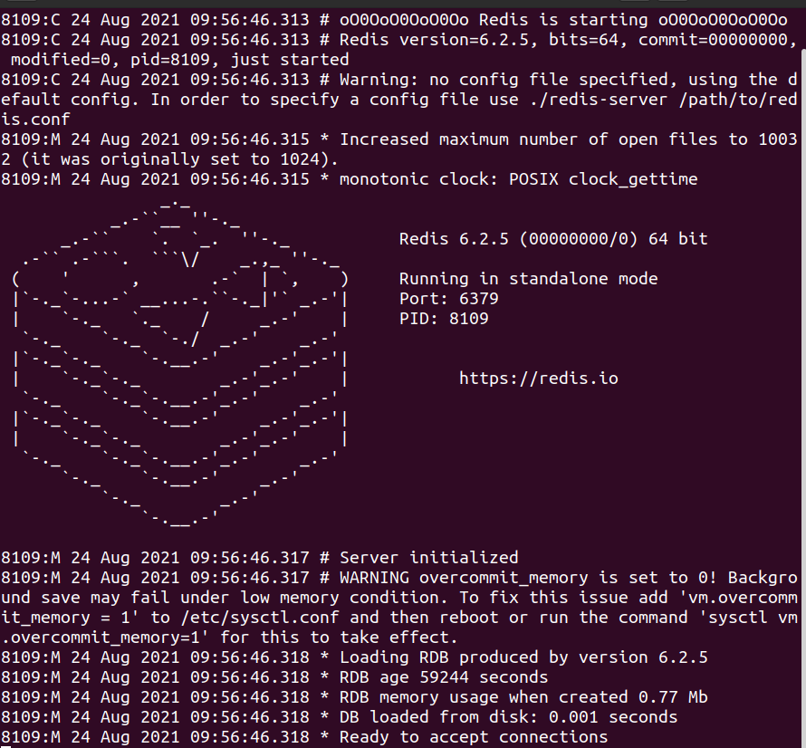
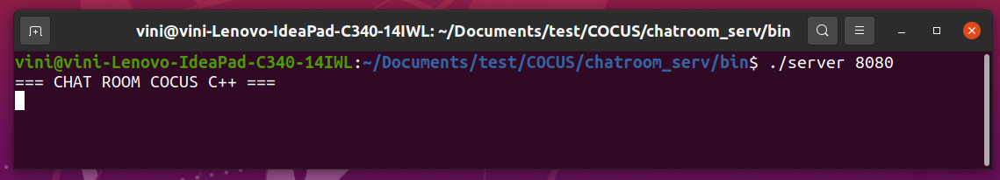
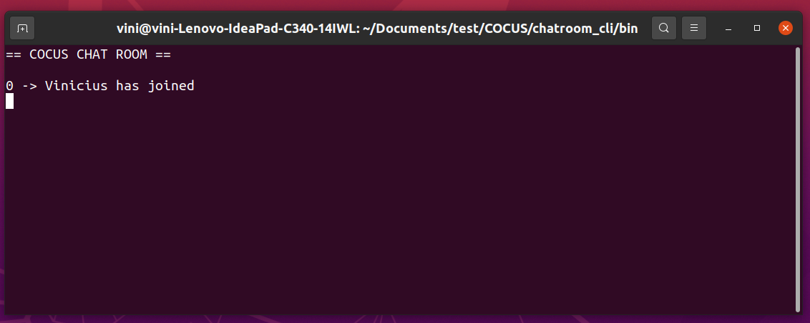
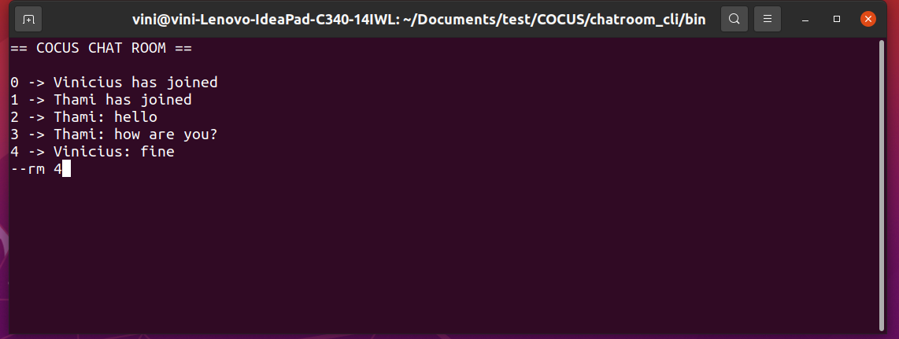

# Chat Room :desktop_computer:


This project contains a chat room and a integration with Redis TB 

:play_or_pause_button: Video: 

[](https://youtu.be/3qmcY8TxwWA)

## Dependence

You will need the Redis for this project, see how to install this in [Redis Download](https://redis.io/download)

To run this project is necessary install the [Redis-cpp](https://github.com/tdv/redis-cpp) library and you'll need to install the boost

Boost install:

```
sudo apt-get install libboost-all-dev
```

Redis-cpp install:

```
git clone https://github.com/tdv/redis-cpp.git  
cd redis-cpp
mkdir build  
cd build  
cmake ..  
make  
make install  
```


## Run the project

### Start Regis

First of all we will need to start the Redis DB server

for this enter in the default folder and run the redis-server

```
cd redis-stable/src/
./redis-server
```
The image below should be appear.



So Redis is running.

### Start Chatroom server

This repository contains the executable files.

To run this files enter in the folder chatroom_server/bin and run the server with a port that you will choose as your room port for example "8080"

```
cd chatroom_server/bin
./server 8080
```

The server is responsible for connect the users and send their messages to Redis DB



its code is inside the foulder chatroom_server/src. if you want to rebuild this project enter in folder build inside the terminal and tipe "make"

## Start a new Client


Enter in the folder chatroom_cli/bin and run the client in the same port than you started the cli, in my example "8080"

```
cd chatroom_cli/bin
./cli 8080
```

Next you need to choose a name between 2 and 30 characters.



Start news clients and let's chat.

## How to delete a message

To delete a message you'll type "--rm" and the **ID** of the message.

```
--rm 'ID'
```

You only can remove the message from the client that typed the message. see the image below (that Vinicius will remove your our message "4").



"exit" is a keyword reserved to exit the room, but ctrl+c is also accept.

## References

https://www.youtube.com/watch?v=fNerEo6Lstw&ab_channel=IdiotDeveloper

https://redis.io/clients

https://github.com/tdv/redis-cpp
